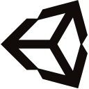

# 🚀 André Comegno
**`Programador (Desenvolvedor/Digital/Criador)`**

Sou um programador jr Back-End, desenvolvedor de mobile android, jogos indie e criador de conteúdo. Todos os meus projetos são feitos a partir de uma ideia desde o planejamento até o design, resolvendo problemas e corrigindo bugs. 
Os vídeos são construídos da mesma forma, desde a ideia, o planejamento, até a publicação. O conteúdo no meu canal do YouTube "[Format C2 Pontos][youtube]" com um pouco mais de 1 mil inscritos.

  
  
  
  

---

### 👾 Habilidades

  

 

#

[youtube]: https://youtube.com/formatc2pontosbr
